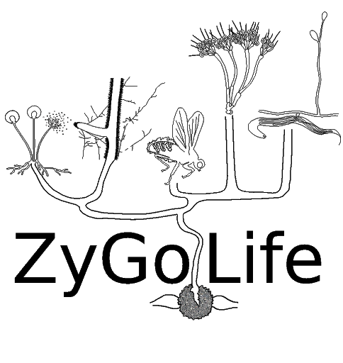

--- 
title: "Zygolabs: Zygomycete Fungi In Teaching And Research"
author: "Joseph W. Spatafora, Ying Chang, Jason E. Stajich, Derreck Carter-House, Yan Wang, Matthew E. Smith, Nicole Reynolds, Tim James, Kevin Amses, William Davis, Merlin White, Greg Bonito, Jessie Uehling, Robert Roberson"
date: "`r Sys.Date()`"
site: bookdown::bookdown_site
output: bookdown::gitbook
documentclass: book
bibliography: [book.bib]
biblio-style: apalike
link-citations: yes
fig_caption: yes
github-repo: Zygolife/Zygo_bookdown
description: "Online resources for Zygomycete Fungi In Teaching And Research."
---

# Preface {-}

ZyGoLife is an interdisciplinary research consortium focused on advancing research and education of zygomycete fungi.  ZyGoLife is funded by the National Science Foundation as part of the Genealogy of Life Program (DEB-1441604, DEB-1441715, DEB-1441677, DEB-1441728). It is based in numerous laboratories and institutions with research expertise in systematics, ecology, cell biology, genomics, and evolutionary biology.

Zygomycetes are an important group of fungi with respect to evolutionary origins of terrestrial fungi, ecological processes in nature, and industrial uses by humans. They are, however, one of the more understudied groups of fungi.  To advance the study of zygomycetes, ZyGoLife is producing _ZyGoLabs: Zygomycete Fungi in Teaching and Research_.  It is our hope that this effort will advance teaching and research of zygomycetes, and that it will entice more teachers to incorporate them in the classroom and more mycologists – professors and students alike – to study them.  The title of the book is an homage to _Zoosporic Fungi in Teaching and Research_, which is how many of us first learned the mycology of flagellated fungi.

This version of _ZyGoLabs: Zygomycete Fungi in Teaching and Research_ is a prelease draft and served as the basis for the ZyGoLife Workshop held at the annual Mycological Society of America meeting on July 15, 2017 at the University of Georgia, Athens GA.  It will be further developed over the near future and released as a formal publication.

_ZyGoLabs: Zygomycete Fungi in Teaching and Research_ is dedicated to Gerald L. Benny, Kerry L. O'Donnell and Robert W. Lichtwardt.  They carried the torch in zygomycete fungi research over the past 40 years, providing the foundation for today's researchers in zygomycete biology.  This publication and indeed the ZyGoLife research consortium would not be possible without them.

